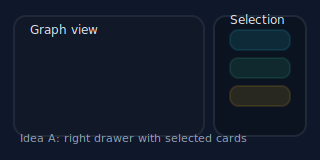

# Selected-device info concepts

This page sketches options for presenting details about selected devices now that the main list is removed.

## Idea A — Side drawer of cards

- Sticky drawer on the right showing selected devices as cards (name, brand/model, type pill, clear button).
- Keeps graph full-width while making selections obvious.
- Scales to multiple selections with wrapping cards and scroll inside the drawer.

## Idea B — Bottom dock with tabs

- A bottom panel with tabs for **Selected**, **Details**, and **Traffic**.
- Selected tab shows chips/cards; Details tab can show port info; Traffic tab could show mini sparkline per link.
- Works well for many selections without stealing horizontal space from the graph.

## Idea C — Inline hover summary (no image)
- Show a compact pill near the graph bottom-left listing selected names; clicking it opens a popover with details/actions.
- Minimal footprint; good for quick glances; relies on hover/click to expand.

Recommendation: start with **Idea A** (drawer/cards) for clarity and ease of implementation, then evolve to tabs (Idea B) if we need deeper details.
