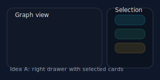
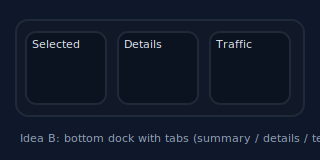
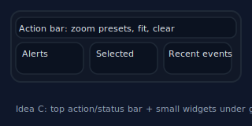
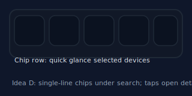

# Selected-device info concepts

This page sketches options for presenting details about selected devices now
that the main list is removed.

## Idea A — Side drawer of cards

- Sticky drawer on the right showing selected devices as cards (name,
  brand/model, type pill, clear button).
- Keeps graph full-width while making selections obvious.
- Scales to multiple selections with wrapping cards and scroll inside the
  drawer.

## Idea B — Bottom dock with tabs

- A bottom panel with tabs for **Selected**, **Details**, and **Traffic**.
- Selected tab shows chips/cards; Details tab can show port info; Traffic tab
  could show mini sparkline per link.
- Works well for many selections without stealing horizontal space from the
  graph.

## Idea C — Action bar + widgets

- Adds a top action bar (zoom presets, fit to screen, clear selection).
- Under the graph: three compact widgets for Alerts, Selected, and Recent
  Events.
- Gives operators quick triage at a glance without covering the graph.

## Idea D — Chip row

- Single-line chip row under the search bar showing selected devices; tapping a
  chip opens the detail drawer.
- Extremely compact; good for mobile where vertical space is tight.

Recommendation: start with **Idea A** (drawer/cards) for clarity and ease of
implementation. For mobile, pair with Idea D’s chip row to keep the selection
visible without crowding the graph; add Idea C’s action bar later for faster
zoom/reset and alert surfacing.
