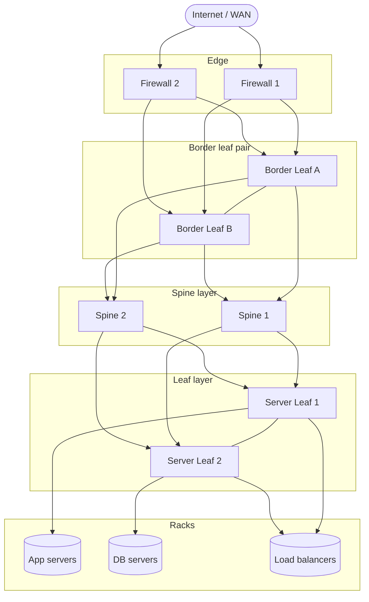

# Leaf–spine datacenter structure (typical)

This project includes a `datacenter` fixture labeled “spine–leaf”. In a _real_
leaf–spine fabric, it’s normal for Internet/edge devices (ISP handoff, DCI,
firewalls, edge routers) to connect to **border leaf switches**, not directly to
the spines.

## Why firewalls connect to leafs (not spines)

A spine layer is designed to be a **pure transit core** inside the fabric:

- **Spines are not where endpoints attach.** The only devices that should
  connect to spines are **leaf switches**.
- **Spines should stay simple and uniform.** Connecting
  firewalls/routers/servers directly to spines breaks the “any leaf can reach
  any leaf in 1 hop” model and complicates operations.
- **Scale and cabling.** Spines have high radix and a limited number of ports;
  spending spine ports on edge devices reduces how many leafs you can support.
- **Fault domains.** Edge devices dual-home to a **pair of border leafs** (often
  MLAG/vPC) so either border leaf can fail without taking out the Internet edge.
- **Routing policy belongs at the edge.** External BGP, NAT, security zones,
  default routes, etc. are handled at firewalls/edge routers and _advertised
  into the fabric_ through the border leafs.

So the expected pattern is:

- Internet / WAN
- Edge router(s) and/or firewall pair
- **Border leaf pair** (the “entry point” into the fabric)
- Spines
- All other leafs
- Racks / servers / service appliances

## Standard components

### 1) Leaf switches

Leafs are the _attachment_ layer:

- Connect to servers (ToR), storage, service appliances, and the border/edge
  devices.
- Connect upward to **every spine** (or at least 2 spines) for full bisection
  bandwidth.
- Often deployed as pairs per rack row or per rack (depending on design).

You’ll often see specialized leaf roles:

- **Border leafs**: connect the fabric to external networks (Internet, WAN, DCI,
  campus core).
- **Server leafs**: connect primarily to servers and service appliances.

### 2) Spine switches

Spines are the _fabric_ core:

- Connect _only_ to leafs.
- Provide predictable, uniform latency and bandwidth.
- Typically run L3 routing. Leafs run L3 uplinks to spines.

### 3) Edge / services

Common edge/service devices and where they attach:

- **Firewalls / edge routers**: connect to a border leaf pair.
- **Load balancers**: usually connect to server leafs (like servers), often
  dual-homed to a leaf pair.
- **Storage**: depends (L2/L3, iSCSI/NVMe/TCP, etc.), but typically attaches at
  leafs.

## How traffic flows

- **East–west (server ↔ server)**: server leaf → spine → server leaf.
- **North–south (Internet ↔ server)**: border leaf → spine → server leaf, with
  policy enforced at the firewall/edge.

```mermaid
sequenceDiagram
	autonumber
	participant U as Internet user
	participant FW as Firewall pair
	participant BL as Border leaf pair
	participant SP as Spine layer
	participant SL as Server leaf pair
	participant APP as App
	participant DB as DB

	rect rgb(15, 23, 42)
		note right of U: North–south (Internet → App)
		U->>FW: TCP/443
		FW->>BL: Allowed + NAT/policy
		BL->>SP: Routed into fabric
		SP->>SL: ECMP hop
		SL->>APP: Deliver to host
	end

	rect rgb(15, 23, 42)
		note right of APP: East–west (App → DB)
		APP->>SL: L2/L3 overlay
		SL->>SP: Routed/encapsulated (EVPN/VXLAN)
		SP->>SL: ECMP hop
		SL->>DB: Deliver to host
	end
```

## L2/L3 overlay (common modern approach)

Many modern leaf–spine fabrics use:

- L3 underlay (routing between leafs and spines)
- VXLAN/EVPN overlay for L2 segments and tenant separation

This keeps the physical fabric stable while allowing flexible L2/L3 segmentation
on top.

## Mapping to this repo’s `datacenter` fixture

In the fixture:

- Firewalls connect to Leaf-1/Leaf-2 because those are acting as **border
  leafs**.
- Spines connect to all leafs.
- Load balancers and servers attach to Leaf-3/Leaf-4 (acting as **server
  leafs**).

This matches the common “border leaf” pattern and avoids directly hanging
endpoints off spines.
